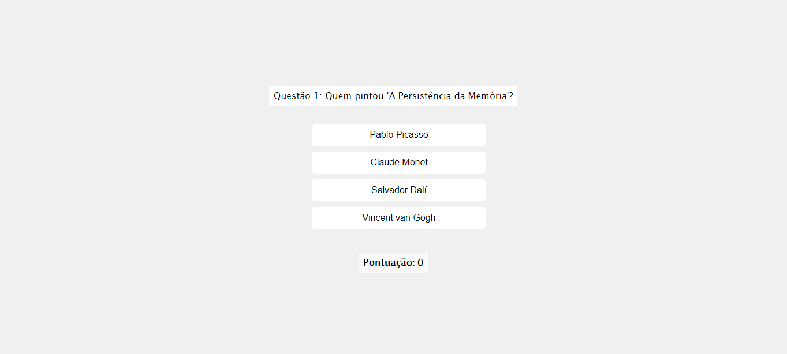

# Quiz de Conhecimentos Gerais em React

Este é um projeto de Quiz de Conhecimentos Gerais desenvolvido em React. O objetivo deste aplicativo é oferecer aos usuários a oportunidade de testar e expandir seu conhecimento em diversas áreas.

## Funcionalidades

- Apresenta uma série de perguntas de múltipla escolha sobre diversos tópicos.
- Os usuários podem selecionar suas respostas e receber feedback imediato sobre a corretude de suas escolhas.
- Mantém uma contagem de pontos para acompanhar o desempenho do usuário ao longo do quiz.
- Interface amigável e responsiva para uma experiência de usuário agradável em qualquer dispositivo.

## Tecnologias Utilizadas

Este projeto foi desenvolvido utilizando as seguintes tecnologias:

- React: Biblioteca JavaScript para construção de interfaces de usuário.
- HTML5: Linguagem de marcação para estruturação do conteúdo.
- CSS3: Linguagem de estilo para estilização da aplicação.
- JavaScript: Linguagem de programação para a lógica do aplicativo.

## Como Contribuir

Se você deseja contribuir para este projeto, siga as etapas abaixo:

1. Faça um fork deste repositório.
2. Clone o repositório forkado para o seu ambiente de desenvolvimento local.
3. Implemente suas melhorias ou correções de bugs.
4. Teste suas alterações cuidadosamente.
5. Envie um pull request com uma descrição clara das alterações propostas.

## Instalação

Para executar este projeto em seu ambiente local, siga estas etapas:

1. Clone este repositório para o seu ambiente local.
2. No diretório raiz do projeto, execute `npm install` para instalar as dependências.
3. Após a instalação, execute `npm start` para iniciar o servidor de desenvolvimento.
4. Abra seu navegador e acesse `http://localhost:3000` para visualizar o aplicativo.

## Imagem do projeto:

